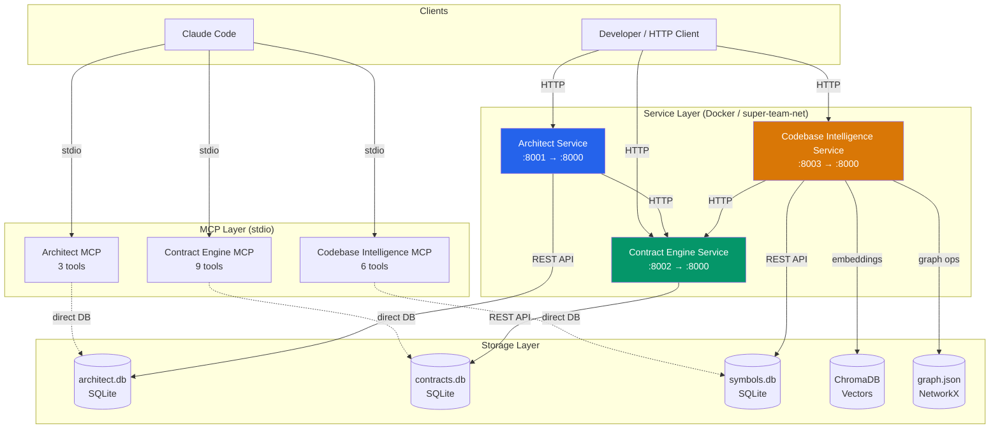

# Super Agent Team

A multi-service architecture analysis platform that helps developers and AI agents decompose product requirements, manage API contracts, and understand codebases. Built with Python, FastAPI, and integrated with Claude Code through the Model Context Protocol (MCP).

## Architecture



## Services

| Service | Port | Description | Endpoints |
|---------|------|-------------|-----------|
| **Architect** | 8001 | Decomposes PRDs into service boundaries and domain models | 4 |
| **Contract Engine** | 8002 | Manages API contract lifecycle (OpenAPI, AsyncAPI, JSON Schema) | 12 |
| **Codebase Intelligence** | 8003 | Multi-language code analysis with semantic search | 7 |

## Quick Start

### Docker Compose (Recommended)

```bash
# Clone the repository
git clone <repository-url>
cd super-team

# Build and start all services
docker-compose up -d --build

# Verify all services are healthy
curl http://localhost:8001/api/health  # Architect
curl http://localhost:8002/api/health  # Contract Engine
curl http://localhost:8003/api/health  # Codebase Intelligence
```

### Local Development

```bash
# Install dependencies
pip install -e ".[dev]"

# Create data directory
mkdir -p data

# Start services (each in a separate terminal)

# Terminal 1: Contract Engine (start first)
DATABASE_PATH=./data/contracts.db uvicorn src.contract_engine.main:app --host 0.0.0.0 --port 8002

# Terminal 2: Architect
DATABASE_PATH=./data/architect.db CONTRACT_ENGINE_URL=http://localhost:8002 \
  uvicorn src.architect.main:app --host 0.0.0.0 --port 8001

# Terminal 3: Codebase Intelligence
DATABASE_PATH=./data/symbols.db CHROMA_PATH=./data/chroma GRAPH_PATH=./data/graph.json \
  CONTRACT_ENGINE_URL=http://localhost:8002 \
  uvicorn src.codebase_intelligence.main:app --host 0.0.0.0 --port 8003
```

### Claude Code Integration

Place `.mcp.json` in the project root (already included) and Claude Code will auto-discover the MCP servers:

```bash
# MCP servers are configured in .mcp.json
# They start automatically when Claude Code connects
# 18 tools available across 3 servers:
#   - Architect:             decompose_prd, get_service_map, get_domain_model
#   - Contract Engine:       create_contract, list_contracts, get_contract,
#                            validate_contract, detect_breaking_changes,
#                            mark_implementation, get_unimplemented,
#                            generate_tests, check_compliance
#   - Codebase Intelligence: index_file, search_code, get_symbols,
#                            get_dependencies, analyze_graph, detect_dead_code
```

## Example Usage

### Decompose a PRD

```bash
curl -X POST http://localhost:8001/api/decompose \
  -H "Content-Type: application/json" \
  -d '{"prd_text": "# E-Commerce Platform\n\n## User Service\nManages user registration, authentication, and profiles.\n\n## Order Service\nHandles order creation, payment processing, and fulfillment.\n\n## Product Service\nManages product catalog, inventory, and pricing."}'
```

### Create a Contract

```bash
curl -X POST http://localhost:8002/api/contracts \
  -H "Content-Type: application/json" \
  -d '{
    "service_name": "user-service",
    "type": "openapi",
    "version": "1.0.0",
    "spec": {
      "openapi": "3.1.0",
      "info": {"title": "User Service", "version": "1.0.0"},
      "paths": {}
    }
  }'
```

### Search Code Semantically

```bash
curl -X POST http://localhost:8003/api/search \
  -H "Content-Type: application/json" \
  -d '{"query": "authentication middleware", "language": "python", "top_k": 5}'
```

## Technology Stack

| Category | Technology | Version |
|----------|-----------|---------|
| Language | Python | 3.12 |
| Web Framework | FastAPI | 0.129.0 |
| Data Validation | Pydantic | v2 |
| Database | SQLite (WAL mode) | — |
| Vector Store | ChromaDB | 1.5.0 |
| Graph Analysis | NetworkX | 3.6.1 |
| AST Parsing | tree-sitter | 0.25.2 |
| MCP SDK | mcp | >=1.25, <2 |
| Contract Testing | Schemathesis | 4.10.1 |
| API Spec Validation | openapi-spec-validator, prance | >=0.7.0 |
| HTTP Client | httpx | >=0.27.0 |
| Containerization | Docker, Docker Compose | — |

## Project Structure

```
super-team/
├── src/
│   ├── shared/              # Shared models, config, DB, logging, errors
│   │   ├── models/          # 52 Pydantic v2 models
│   │   ├── db/              # ConnectionPool, schema initialization
│   │   ├── config.py        # Service configurations (pydantic-settings)
│   │   ├── constants.py     # Version, ports, service names
│   │   ├── logging.py       # JSON logging, TraceIDMiddleware
│   │   └── errors.py        # Exception hierarchy, FastAPI handlers
│   ├── architect/           # PRD decomposition service
│   │   ├── routers/         # FastAPI endpoints
│   │   ├── services/        # Business logic (parser, boundary, modeler)
│   │   ├── storage/         # ServiceMapStore, DomainModelStore
│   │   ├── main.py          # FastAPI app
│   │   └── mcp_server.py    # MCP server (3 tools)
│   ├── contract_engine/     # Contract management service
│   │   ├── routers/         # FastAPI endpoints
│   │   ├── services/        # Validation, versioning, test generation
│   │   ├── main.py          # FastAPI app
│   │   └── mcp_server.py    # MCP server (9 tools)
│   └── codebase_intelligence/  # Code analysis service
│       ├── parsers/         # Language-specific tree-sitter parsers
│       ├── routers/         # FastAPI endpoints
│       ├── services/        # AST, graph, search, indexing
│       ├── storage/         # SymbolDB, ChromaStore, GraphDB
│       ├── main.py          # FastAPI app
│       └── mcp_server.py    # MCP server (6 tools)
├── docker/                  # Dockerfiles and requirements per service
├── tests/                   # Unit, integration, and MCP tests
├── sample_data/             # Example PRD, OpenAPI, AsyncAPI specs
├── docs/                    # Documentation
│   ├── architecture.md      # Architecture overview
│   ├── api_reference.md     # REST API reference
│   ├── mcp_tools.md         # MCP tools documentation
│   └── deployment.md        # Deployment guide
├── docker-compose.yml       # Docker orchestration
├── pyproject.toml           # Python project config
├── .mcp.json                # MCP server configuration
└── .env.example             # Environment variable template
```

## Documentation

- [Architecture Overview](docs/architecture.md) — Service design, data flow, database schemas
- [API Reference](docs/api_reference.md) — All REST endpoints with examples
- [MCP Tools](docs/mcp_tools.md) — Claude Code integration guide
- [Deployment Guide](docs/deployment.md) — Docker and local setup instructions

## Running Tests

```bash
# Run all tests
pytest tests/ -v

# Run with coverage
pytest tests/ -v --cov=src --cov-report=term-missing

# Run specific test suites
pytest tests/test_architect/ -v
pytest tests/test_contract_engine/ -v
pytest tests/test_codebase_intelligence/ -v
pytest tests/test_integration/ -v
pytest tests/test_mcp/ -v
```

## License

This project is proprietary software.
