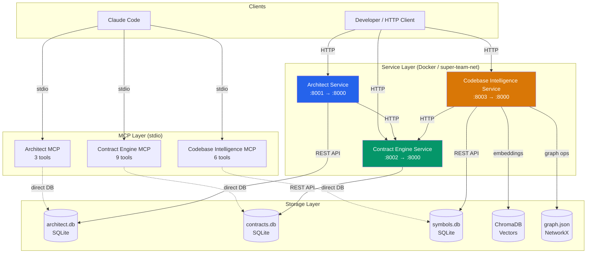

# Super Agent Team

A multi-service orchestration platform that decomposes PRDs into microservices, builds them in parallel using AI agent fleets, integrates them via Docker Compose, and validates the result through a 4-layer quality gate. Built with Python, FastAPI, and integrated with Claude Code through the Model Context Protocol (MCP).

---

## Architecture

```
PRD (plain text)
    |
    v
Super Orchestrator (Build 3)
    |
    +-- Architect MCP ------ Decompose PRD -> ServiceMap
    +-- Contract Engine ---- Register contracts, validate specs
    +-- Builders ----------- agent-team-v15 subprocesses (parallel)
    +-- Integrator --------- Docker Compose 5-file merge + health
    +-- Quality Gate ------- 4-layer scan (service, contract, system, adversarial)
    +-- Fix Pass ----------- P0-P3 priority classification + convergence loop
         |
         v
    Deployed App + QUALITY_GATE_REPORT.md
```

### MCP Service Architecture



## Services

| Service | Port | Description | Endpoints |
|---------|------|-------------|-----------|
| **Architect** | 8001 | Decomposes PRDs into service boundaries and domain models | 4 |
| **Contract Engine** | 8002 | Manages API contract lifecycle (OpenAPI, AsyncAPI, JSON Schema) | 12 |
| **Codebase Intelligence** | 8003 | Multi-language code analysis with semantic search | 7 |

---

## Quick Start

### 3-Command Pipeline

```bash
# 1. Start foundation services
docker compose up -d

# 2. Run the pipeline with your PRD
python -m src.super_orchestrator.cli run your_prd.md --config config.yaml

# 3. Check the result
docker compose --project-name super-team-run4 ps
```

### Docker Compose (Services Only)

```bash
# Clone the repository
git clone <repository-url>
cd super-team

# Build and start all services
docker compose up -d --build

# Verify all services are healthy
curl http://localhost:8001/api/health  # Architect
curl http://localhost:8002/api/health  # Contract Engine
curl http://localhost:8003/api/health  # Codebase Intelligence
```

### Local Development

```bash
# Install dependencies
pip install -e ".[dev]"

# Create data directory
mkdir -p data

# Start services (each in a separate terminal)

# Terminal 1: Contract Engine (start first)
DATABASE_PATH=./data/contracts.db uvicorn src.contract_engine.main:app --host 0.0.0.0 --port 8002

# Terminal 2: Architect
DATABASE_PATH=./data/architect.db CONTRACT_ENGINE_URL=http://localhost:8002 \
  uvicorn src.architect.main:app --host 0.0.0.0 --port 8001

# Terminal 3: Codebase Intelligence
DATABASE_PATH=./data/symbols.db CHROMA_PATH=./data/chroma GRAPH_PATH=./data/graph.json \
  CONTRACT_ENGINE_URL=http://localhost:8002 \
  uvicorn src.codebase_intelligence.main:app --host 0.0.0.0 --port 8003
```

### Claude Code Integration

Place `.mcp.json` in the project root (already included) and Claude Code will auto-discover the MCP servers:

```bash
# MCP servers are configured in .mcp.json
# They start automatically when Claude Code connects
# 18 tools available across 3 servers:
#   - Architect:             decompose_prd, get_service_map, get_domain_model
#   - Contract Engine:       create_contract, list_contracts, get_contract,
#                            validate_contract, detect_breaking_changes,
#                            mark_implementation, get_unimplemented,
#                            generate_tests, check_compliance
#   - Codebase Intelligence: index_file, search_code, get_symbols,
#                            get_dependencies, analyze_graph, detect_dead_code
```

---

## Docker Requirements

| Requirement | Minimum Version | Notes |
|-------------|----------------|-------|
| **Docker Desktop** | 4.x+ | Must be running before pipeline execution |
| **Docker Compose** | v2 (integrated) | The `docker compose` (v2) syntax is required -- not `docker-compose` (v1) |
| **Docker Engine** | 20.10+ | Needed for BuildKit and multi-stage builds |

Docker Compose v2 is bundled with Docker Desktop. If you are running Docker Engine standalone (e.g., on Linux), install the compose plugin separately:

```bash
# Verify Docker Compose v2 is available
docker compose version
# Expected: Docker Compose version v2.x.x
```

---

## Full Configuration Reference

All fields in `config.yaml` have sensible defaults. Only override what you need.

```yaml
# ── Architect Phase ──────────────────────────────────────────
architect:
  max_retries: 2              # Maximum retries for architect decomposition on timeout
  timeout: 900                # Timeout in seconds for architect phase (15 min)
  auto_approve: false         # Auto-approve architecture without human review

# ── Builder Fleet ────────────────────────────────────────────
builder:
  max_concurrent: 3           # Maximum concurrent builder processes (agent-team-v15)
  timeout_per_builder: 1800   # Timeout per builder in seconds (30 min)
  depth: "thorough"           # Build depth: "quick" | "standard" | "thorough"

# ── Integration Testing ─────────────────────────────────────
integration:
  timeout: 600                # Timeout for integration phase in seconds (10 min)
  traefik_image: "traefik:v3.6"  # Traefik image for API gateway
  compose_file: "docker-compose.yml"       # Docker compose file path
  test_compose_file: "docker-compose.test.yml"  # Test compose file path

# ── Quality Gate ─────────────────────────────────────────────
quality_gate:
  max_fix_retries: 3          # Maximum fix retries before giving up
  layer3_scanners:            # Layer 3 scanner categories to run
    - security
    - cors
    - logging
    - trace
    - secrets
    - docker
    - health
  layer4_enabled: true        # Enable Layer 4 adversarial scanning
  blocking_severity: "error"  # Minimum severity to block promotion

# ── Global Pipeline Settings ────────────────────────────────
budget_limit: null            # Pipeline budget limit in USD (null = unlimited)
depth: "standard"             # Pipeline execution depth
phase_timeouts: {}            # Phase timeout overrides (seconds), e.g., { architect: 1200 }
build1_services_dir: ""       # Build 1 services directory (empty = auto-detect)
agent_team_config_path: ""    # Agent team config path (empty = default)
mode: "auto"                  # Execution mode: "docker" | "mcp" | "auto"
output_dir: ".super-orchestrator"  # Output directory for pipeline state
```

### Quality Gate Layers

| Layer | Scope | What It Checks |
|-------|-------|---------------|
| **Layer 1: Service** | Per-service | Dockerfile lint, dependency audit, unit tests |
| **Layer 2: Contract** | Cross-service | OpenAPI/AsyncAPI spec validation, breaking change detection |
| **Layer 3: System** | Infrastructure | Security, CORS, logging, tracing, secrets, Docker config, health endpoints |
| **Layer 4: Adversarial** | End-to-end | Attempts to break the system via fault injection and edge cases |

---

## Example Usage

### Decompose a PRD

```bash
curl -X POST http://localhost:8001/api/decompose \
  -H "Content-Type: application/json" \
  -d '{"prd_text": "# E-Commerce Platform\n\n## User Service\nManages user registration, authentication, and profiles.\n\n## Order Service\nHandles order creation, payment processing, and fulfillment.\n\n## Product Service\nManages product catalog, inventory, and pricing."}'
```

### Create a Contract

```bash
curl -X POST http://localhost:8002/api/contracts \
  -H "Content-Type: application/json" \
  -d '{
    "service_name": "user-service",
    "type": "openapi",
    "version": "1.0.0",
    "spec": {
      "openapi": "3.1.0",
      "info": {"title": "User Service", "version": "1.0.0"},
      "paths": {}
    }
  }'
```

### Search Code Semantically

```bash
curl -X POST http://localhost:8003/api/search \
  -H "Content-Type: application/json" \
  -d '{"query": "authentication middleware", "language": "python", "top_k": 5}'
```

---

## Test Suite Summary

| Category | Count | Description |
|----------|-------|-------------|
| **Unit + Integration** | 985+ | Core service logic, MCP tools, API endpoints |
| **Benchmarks** | 27 | Performance baselines for parsing, indexing, search |
| **E2E** | 87 | Full pipeline tests across build3/run4 |
| **Total** | 1099+ | Across all test categories |

### Running Tests

```bash
# Run all tests
pytest tests/ -v

# Run with coverage
pytest tests/ -v --cov=src --cov-report=term-missing

# Run specific test suites
pytest tests/test_architect/ -v
pytest tests/test_contract_engine/ -v
pytest tests/test_codebase_intelligence/ -v
pytest tests/test_integration/ -v
pytest tests/test_mcp/ -v
```

---

## Technology Stack

| Category | Technology | Version |
|----------|-----------|---------|
| Language | Python | 3.12 |
| Web Framework | FastAPI | 0.129.0 |
| Data Validation | Pydantic | v2 |
| Database | SQLite (WAL mode) | -- |
| Vector Store | ChromaDB | 1.5.0 |
| Graph Analysis | NetworkX | 3.6.1 |
| AST Parsing | tree-sitter | 0.25.2 |
| MCP SDK | mcp | >=1.25, <2 |
| Contract Testing | Schemathesis | 4.10.1 |
| API Spec Validation | openapi-spec-validator, prance | >=0.7.0 |
| HTTP Client | httpx | >=0.27.0 |
| Containerization | Docker, Docker Compose v2 | -- |

---

## Project Structure

```
super-team/
├── src/
│   ├── shared/              # Shared models, config, DB, logging, errors
│   │   ├── models/          # 52 Pydantic v2 models
│   │   ├── db/              # ConnectionPool, schema initialization
│   │   ├── config.py        # Service configurations (pydantic-settings)
│   │   ├── constants.py     # Version, ports, service names
│   │   ├── logging.py       # JSON logging, TraceIDMiddleware
│   │   └── errors.py        # Exception hierarchy, FastAPI handlers
│   ├── architect/           # PRD decomposition service
│   │   ├── routers/         # FastAPI endpoints
│   │   ├── services/        # Business logic (parser, boundary, modeler)
│   │   ├── storage/         # ServiceMapStore, DomainModelStore
│   │   ├── main.py          # FastAPI app
│   │   └── mcp_server.py    # MCP server (3 tools)
│   ├── contract_engine/     # Contract management service
│   │   ├── routers/         # FastAPI endpoints
│   │   ├── services/        # Validation, versioning, test generation
│   │   ├── main.py          # FastAPI app
│   │   └── mcp_server.py    # MCP server (9 tools)
│   ├── codebase_intelligence/  # Code analysis service
│   │   ├── parsers/         # Language-specific tree-sitter parsers
│   │   ├── routers/         # FastAPI endpoints
│   │   ├── services/        # AST, graph, search, indexing
│   │   ├── storage/         # SymbolDB, ChromaStore, GraphDB
│   │   ├── main.py          # FastAPI app
│   │   └── mcp_server.py    # MCP server (6 tools)
│   └── super_orchestrator/  # Pipeline orchestrator (Build 3)
│       ├── cli.py           # CLI entry point
│       ├── config.py        # Pipeline configuration
│       ├── pipeline.py      # Phase execution engine
│       ├── state.py         # State persistence
│       ├── state_machine.py # Phase transitions
│       ├── cost.py          # Budget tracking
│       ├── display.py       # Terminal output
│       ├── shutdown.py      # Graceful shutdown
│       └── exceptions.py    # Pipeline exceptions
├── docker/                  # Dockerfiles and requirements per service
├── tests/                   # Unit, integration, and MCP tests
├── sample_data/             # Example PRD, OpenAPI, AsyncAPI specs
├── docs/                    # Documentation
│   ├── architecture.md      # Architecture overview
│   ├── api_reference.md     # REST API reference
│   ├── mcp_tools.md         # MCP tools documentation
│   └── deployment.md        # Deployment guide
├── config.yaml              # Pipeline configuration
├── docker-compose.yml       # Docker orchestration
├── pyproject.toml           # Python project config
├── .mcp.json                # MCP server configuration
└── .env.example             # Environment variable template
```

---

## Troubleshooting

### ChromaDB First-Download Timeout

ChromaDB downloads embedding model weights on first use (~400 MB). This can time out behind corporate proxies or on slow connections.

**Symptoms:** `TimeoutError` or `ConnectionError` during `chromadb.Client()` initialization.

**Solutions:**
- Pre-download the model: `python -c "import chromadb; chromadb.Client()"`
- Increase the timeout via environment variable: `ONNXRUNTIME_DOWNLOAD_TIMEOUT=600`
- If behind a proxy, ensure `HTTPS_PROXY` is set before starting the service

### pact-python FFI on Alpine

The `pact-python` library requires the Pact FFI shared library, which may not compile on Alpine Linux (musl libc).

**Symptoms:** `ImportError: libpact_ffi.so: cannot open shared object file`

**Solutions:**
- Use a Debian-based Docker image instead of Alpine (`python:3.12-slim`)
- Install build dependencies: `apk add gcc musl-dev libffi-dev`
- Pin `pact-python` to a version with pre-built musl wheels

### tree-sitter 0.25.x API

tree-sitter 0.25.x introduced breaking API changes from 0.21.x/0.22.x. The `Language` and `Parser` APIs changed significantly.

**Symptoms:** `AttributeError: module 'tree_sitter' has no attribute 'Language'` or `TypeError` when constructing parsers.

**Solutions:**
- Ensure you are using `tree-sitter>=0.25.0` (pinned in `pyproject.toml`)
- Use the new API: `Language(tree_sitter_python.language())` instead of `Language(tree_sitter_python.language(), "python")`
- Language bindings must also be updated (e.g., `tree-sitter-python>=0.23.0`)

### Nested asyncio.run() in Build 3

The super orchestrator pipeline uses `asyncio.run()` at the top level. If a called function also uses `asyncio.run()`, Python raises `RuntimeError: This event loop is already running`.

**Symptoms:** `RuntimeError: This event loop is already running` during pipeline execution.

**Solutions:**
- All internal async calls use `await` within the existing event loop
- For synchronous code that needs async: use `asyncio.get_event_loop().run_until_complete()` only when no loop is running
- The pipeline wraps subprocess calls in `asyncio.create_subprocess_exec`, avoiding nested loops

### Docker Compose v1 vs v2

The pipeline requires Docker Compose v2 (`docker compose` as a subcommand), not v1 (`docker-compose` as a standalone binary).

**Symptoms:** `FileNotFoundError: [Errno 2] No such file or directory: 'docker-compose'` or unexpected YAML parsing errors.

**Solutions:**
- Upgrade to Docker Desktop 4.x+ (includes Compose v2)
- On Linux without Docker Desktop: `sudo apt install docker-compose-plugin`
- Verify: `docker compose version` should print `v2.x.x`
- If you must use v1, create a symlink: `ln -s /usr/bin/docker-compose /usr/local/bin/docker` (not recommended)

### Windows WinError 206

On Windows, the `claude_agent_sdk` passes large CLI arguments (`--system-prompt` at ~44K chars, `--agents` at ~110K chars) that exceed the Windows `CreateProcess` limit of 32,767 characters.

**Symptoms:** `OSError: [WinError 206] The filename or extension is too long` when spawning builder subprocesses.

**Solutions:**
- Apply the temp file optimization patch to `subprocess_cli.py` in the SDK: any flag value >4K chars is written to a `@tempfile` instead of passed inline
- Location: `<python-install>/Lib/site-packages/claude_agent_sdk/_internal/transport/subprocess_cli.py`
- After patching, delete `__pycache__/subprocess_cli.cpython-312.pyc` to force recompilation
- This patch is required for all Windows users running the pipeline

---

## Documentation

- [Architecture Overview](docs/architecture.md) -- Service design, data flow, database schemas
- [API Reference](docs/api_reference.md) -- All REST endpoints with examples
- [MCP Tools](docs/mcp_tools.md) -- Claude Code integration guide
- [Deployment Guide](docs/deployment.md) -- Docker and local setup instructions

---

## License

This project is proprietary software.
