# Super Agent Team -- Architecture Document

> **Version:** 1.0.0
> **Last Updated:** 2026-02-16

---

## Table of Contents

1. [Project Overview](#project-overview)
2. [High-Level Architecture](#high-level-architecture)
3. [Services](#services)
   - [Architect Service](#1-architect-service)
   - [Contract Engine Service](#2-contract-engine-service)
   - [Codebase Intelligence Service](#3-codebase-intelligence-service)
4. [Service Communication](#service-communication)
5. [Shared Infrastructure](#shared-infrastructure)
6. [Technology Stack](#technology-stack)
7. [Network Architecture (Docker)](#network-architecture-docker)
8. [Database Schemas](#database-schemas)
9. [Data Flow](#data-flow)

---

## Project Overview

Super Agent Team is a multi-service architecture analysis platform that helps developers and AI agents decompose product requirements, manage API contracts, and understand codebases. It consists of three interconnected Python microservices built with FastAPI, containerized with Docker, and integrated with Claude Code through MCP (Model Context Protocol) servers.

The platform addresses three core concerns:

- **Requirement Decomposition** -- Breaking down Product Requirements Documents into service boundaries and domain models.
- **Contract Management** -- Storing, validating, versioning, and detecting breaking changes in API contracts.
- **Codebase Understanding** -- Parsing source code into symbols, building dependency graphs, and enabling semantic search.

---

## High-Level Architecture

---

## Services

### 1. Architect Service

| Property | Value |
|---|---|
| **External Port** | 8001 |
| **Internal Port** | 8000 |
| **Version** | 1.0.0 |
| **Database** | `architect.db` (SQLite, WAL mode) |

#### Purpose

Decomposes Product Requirements Documents (PRDs) into service boundaries and domain models. Uses deterministic algorithms (no LLM) for entity extraction, boundary identification, and contract generation.

#### Outputs

- **ServiceMap** -- Identified service boundaries and their responsibilities.
- **DomainModel** -- Entity definitions and relationships extracted from the PRD.
- **Contract Stubs** -- OpenAPI 3.1 specifications generated for each identified service boundary.

#### Key Modules

| Module | Responsibility |
|---|---|
| `prd_parser` | Parses and tokenizes PRD content for downstream processing |
| `service_boundary` | Identifies service boundaries from parsed PRD entities |
| `domain_modeler` | Constructs domain models (entities, relationships) from PRD content |
| `validator` | Validates decomposition outputs for consistency and completeness |
| `contract_generator` | Generates OpenAPI 3.1 contract stubs from service boundaries |

#### Storage

- **ServiceMapStore** -- Persists generated service maps in SQLite.
- **DomainModelStore** -- Persists generated domain models in SQLite.

#### Database Tables

- `service_maps`
- `domain_models`
- `decomposition_runs`

#### Inter-Service Communication

Communicates with Contract Engine via HTTP (configured through `CONTRACT_ENGINE_URL`) to register generated contract stubs after decomposition.

---

### 2. Contract Engine Service

| Property | Value |
|---|---|
| **External Port** | 8002 |
| **Internal Port** | 8000 |
| **Version** | 1.0.0 |
| **Database** | `contracts.db` (SQLite, WAL mode) |

#### Purpose

Manages the full API contract lifecycle: storage, validation, versioning, breaking change detection, implementation tracking, test generation, and compliance checking.

#### Supported Specifications

- OpenAPI 3.0.x
- OpenAPI 3.1.0
- AsyncAPI 3.0
- JSON Schema

#### Features

| Feature | Description |
|---|---|
| Contract CRUD | Create, read, update, delete contracts |
| Spec Validation | Validate contracts against OpenAPI, AsyncAPI, and JSON Schema specifications |
| Breaking Change Detection | Compare contract versions and identify breaking changes |
| Implementation Tracking | Track which services have implemented a given contract |
| Test Generation | Generate contract tests using Schemathesis |
| Compliance Checking | Verify services comply with their registered contracts |

#### Database Tables

- `build_cycles`
- `contracts`
- `contract_versions`
- `breaking_changes`
- `implementations`
- `test_suites`
- `shared_schemas`
- `schema_consumers`

---

### 3. Codebase Intelligence Service

| Property | Value |
|---|---|
| **External Port** | 8003 |
| **Internal Port** | 8000 |
| **Version** | 1.0.0 |
| **Database** | `symbols.db` (SQLite, WAL mode) + ChromaDB (vector store) + NetworkX (dependency graph) |

#### Purpose

Provides multi-language codebase analysis through AST parsing, symbol extraction, dependency graph construction, and semantic search. Enables dead code detection and service interface extraction.

#### Supported Languages

| Language | AST Parser |
|---|---|
| Python | tree-sitter |
| TypeScript | tree-sitter |
| C# | tree-sitter |
| Go | tree-sitter |

#### Features

| Feature | Description |
|---|---|
| AST Parsing | Multi-language parsing via tree-sitter |
| Symbol Extraction | Extract classes, functions, interfaces, types, enums, variables, methods |
| Import Resolution | Resolve import statements to target files and symbols |
| Dependency Graph | Construct and query dependency graphs using NetworkX |
| Semantic Search | Vector similarity search via ChromaDB with all-MiniLM-L6-v2 embeddings |
| Dead Code Detection | Identify unreferenced symbols across the codebase |
| Service Interface Extraction | Extract public API surfaces of services |

#### Storage

- **SQLite** (`symbols.db`) -- Indexed files, symbols, dependency edges, import references, graph snapshots.
- **ChromaDB** -- Vector embeddings for semantic search using the all-MiniLM-L6-v2 model.
- **NetworkX** -- In-memory dependency graph with snapshot persistence.

#### Database Tables

- `indexed_files`
- `symbols`
- `dependency_edges`
- `import_references`
- `graph_snapshots`

#### Inter-Service Communication

Communicates with Contract Engine via HTTP (configured through `CONTRACT_ENGINE_URL`) for contract-related operations.

---

## Service Communication

```mermaid
graph LR
    A[Architect Service\n:8001 ext / :8000 int] -- "HTTP POST\nRegister contract stubs\n(CONTRACT_ENGINE_URL)" --> CE[Contract Engine Service\n:8002 ext / :8000 int]

    CI[Codebase Intelligence Service\n:8003 ext / :8000 int] -- "HTTP\nContract operations\n(CONTRACT_ENGINE_URL)" --> CE

    subgraph "Claude Code Integration"
        MCP_A[Architect MCP Server\nstdio] --> A
        MCP_CE[Contract Engine MCP Server\nstdio] --> CE
        MCP_CI[Codebase Intel MCP Server\nstdio] --> CI
    end
```

### Communication Patterns

- **Architect to Contract Engine** -- After decomposing a PRD, the Architect Service makes synchronous HTTP calls to Contract Engine to register generated OpenAPI 3.1 contract stubs. The target URL is configured via the `CONTRACT_ENGINE_URL` environment variable.
- **Codebase Intelligence to Contract Engine** -- The Codebase Intelligence Service makes synchronous HTTP calls to Contract Engine for contract-related operations (e.g., looking up contracts for service interfaces). Configured via `CONTRACT_ENGINE_URL`.
- **All REST APIs** -- Each service exposes its REST API on port 8000 internally within the Docker network. Externally, ports are mapped as 8001 (Architect), 8002 (Contract Engine), and 8003 (Codebase Intelligence).
- **MCP Servers** -- Each service provides an MCP server that communicates over stdio, enabling Claude Code to invoke service tools directly.
- **No Message Broker** -- All inter-service communication is synchronous HTTP. There is no message queue or event bus.

### HTTP Client

Inter-service HTTP communication uses **httpx** as the HTTP client library.

---

## Shared Infrastructure

All three services depend on a shared library located at `src/shared/`.

### Shared Models

52 Pydantic v2 models distributed across four modules:

| Module | Count | Description |
|---|---|---|
| `architect.py` | 13 models | Service maps, domain models, decomposition types |
| `contracts.py` | 24 models | Contracts, versions, breaking changes, implementations, test suites, compliance, shared schemas |
| `codebase.py` | 12 models | Symbols, files, dependency edges, import references, graph snapshots |
| `common.py` | 3 models | Shared base types used across services |

### Database (ConnectionPool)

- Thread-local SQLite connections via a custom `ConnectionPool`.
- **WAL mode** enabled for concurrent read access.
- `busy_timeout` set to 30000ms (30 seconds).
- `foreign_keys` enforcement enabled (`PRAGMA foreign_keys = ON`).

### Configuration

- Built on **pydantic-settings** for configuration loading.
- All configuration values sourced from environment variables.

### Logging

- **Structured JSON logging** across all services.
- **TraceIDMiddleware** injects and propagates an `X-Trace-ID` header for distributed tracing across HTTP calls.

### Error Handling

- Custom exception hierarchy with `AppError` as the base exception class.
- FastAPI exception handlers translate `AppError` subclasses into appropriate HTTP error responses.

---

## Technology Stack

| Category | Technology | Version |
|---|---|---|
| Language | Python | 3.12 |
| Web Framework | FastAPI | 0.129.0 |
| ASGI Server | Uvicorn | -- |
| Data Validation | Pydantic v2 | -- |
| Configuration | pydantic-settings | -- |
| Database | SQLite (WAL mode) | via ConnectionPool |
| Vector Store | ChromaDB | 1.5.0 |
| Graph Engine | NetworkX | 3.6.1 |
| AST Parsing | tree-sitter | 0.25.2 |
| Supported Grammars | tree-sitter (Python, TypeScript, C#, Go) | -- |
| MCP Integration | MCP SDK | >=1.25, <2 |
| Contract Testing | Schemathesis | 4.10.1 |
| OpenAPI Validation | openapi-spec-validator, prance | -- |
| Schema Validation | jsonschema | -- |
| HTTP Client | httpx | -- |
| Containerization | Docker, Docker Compose | -- |

---

## Network Architecture (Docker)

### Container Configuration

| Property | Value |
|---|---|
| **Base Image** | `python:3.12-slim` |
| **User** | `appuser` (non-root) |
| **Network** | `super-team-net` (bridge driver) |

### Volumes

| Volume | Container | Mount Point |
|---|---|---|
| `architect-data` | architect | `/data` |
| `contract-data` | contract-engine | `/data` |
| `intel-data` | codebase-intel | `/data` |

### Health Checks

All services use the same health check configuration:

| Property | Value |
|---|---|
| **Mechanism** | Python `urllib.request` to `/api/health` |
| **Interval** | 10 seconds |
| **Timeout** | 5 seconds |
| **Retries** | 5 |

### Startup Dependencies

| Service | Depends On | Condition |
|---|---|---|
| `architect` | `contract-engine` | `healthy` |
| `codebase-intel` | `contract-engine` | `healthy` |
| `contract-engine` | -- | -- |

The Contract Engine Service starts first and must pass its health check before the Architect and Codebase Intelligence services will start.

---

## Database Schemas

### architect.db

#### Table Details

**service_maps**

| Column | Description |
|---|---|
| `id` | Primary key |
| `project_name` | Name of the project |
| `prd_hash` | Hash of the source PRD content |
| `map_json` | JSON-serialized service map |
| `build_cycle_id` | Associated build cycle identifier |
| `generated_at` | Timestamp of generation |

**domain_models**

| Column | Description |
|---|---|
| `id` | Primary key |
| `project_name` | Name of the project |
| `model_json` | JSON-serialized domain model |
| `generated_at` | Timestamp of generation |

**decomposition_runs**

| Column | Description |
|---|---|
| `id` | Primary key |
| `prd_content_hash` | Hash of the PRD content used for this run |
| `service_map_id` | Foreign key to `service_maps` |
| `domain_model_id` | Foreign key to `domain_models` |
| `validation_issues` | Validation issues found during decomposition |
| `interview_questions` | Generated interview/clarification questions |
| `status` | Run status: `pending`, `running`, `completed`, `failed`, or `review` |
| `started_at` | Timestamp when the run started |
| `completed_at` | Timestamp when the run completed |

---

### contracts.db

#### Table Details

**build_cycles**

| Column | Description |
|---|---|
| `id` | Primary key |
| `project_name` | Name of the project |
| `started_at` | Timestamp when the build cycle started |
| `completed_at` | Timestamp when the build cycle completed |
| `status` | Cycle status: `running`, `completed`, `failed`, or `paused` |
| `services_planned` | Number of services planned in this cycle |
| `services_completed` | Number of services completed so far |
| `total_cost_usd` | Total cost in USD for the build cycle |

**contracts**

| Column | Description |
|---|---|
| `id` | Primary key |
| `type` | Contract type: `openapi`, `asyncapi`, or `json_schema` |
| `version` | Semantic version of the contract |
| `service_name` | Name of the service this contract belongs to |
| `spec_json` | JSON-serialized specification |
| `spec_hash` | Hash of the specification content |
| `status` | Contract status: `active`, `deprecated`, or `draft` |
| `build_cycle_id` | Foreign key to `build_cycles` |
| `created_at` | Timestamp of creation |
| `updated_at` | Timestamp of last update |
| **Unique Constraint** | `(service_name, type, version)` |

**contract_versions**

| Column | Description |
|---|---|
| `id` | Primary key |
| `contract_id` | Foreign key to `contracts` |
| `version` | Version string |
| `spec_hash` | Hash of the specification at this version |
| `build_cycle_id` | Foreign key to `build_cycles` |
| `is_breaking` | Whether this version introduced breaking changes |
| `change_summary` | Summary of changes in this version |
| `created_at` | Timestamp of creation |

**breaking_changes**

| Column | Description |
|---|---|
| `id` | Primary key |
| `contract_version_id` | Foreign key to `contract_versions` |
| `change_type` | Type of breaking change |
| `json_path` | JSON path to the changed element |
| `old_value` | Previous value |
| `new_value` | New value |
| `severity` | Severity level: `error`, `warning`, or `info` |
| `affected_consumers` | List of consumers affected by this change |
| `created_at` | Timestamp of creation |

**implementations**

| Column | Description |
|---|---|
| `id` | Primary key |
| `contract_id` | Foreign key to `contracts` |
| `service_name` | Name of the implementing service |
| `evidence_path` | File path to implementation evidence |
| `status` | Implementation status: `verified`, `pending`, or `failed` |
| `verified_at` | Timestamp of verification |
| `created_at` | Timestamp of creation |
| **Unique Constraint** | `(contract_id, service_name)` |

**test_suites**

| Column | Description |
|---|---|
| `id` | Primary key |
| `contract_id` | Foreign key to `contracts` |
| `framework` | Test framework: `pytest` or `jest` |
| `test_code` | Generated test source code |
| `test_count` | Number of tests in the suite |
| `spec_hash` | Hash of the specification used for generation |
| `generated_at` | Timestamp of generation |
| **Unique Constraint** | `(contract_id, framework)` |

**shared_schemas**

| Column | Description |
|---|---|
| `name` | Primary key -- schema name |
| `schema_json` | JSON-serialized schema |
| `owning_service` | Service that owns this schema |
| `created_at` | Timestamp of creation |
| `updated_at` | Timestamp of last update |

**schema_consumers**

| Column | Description |
|---|---|
| `schema_name` | Part of composite primary key; foreign key to `shared_schemas` |
| `service_name` | Part of composite primary key; consuming service name |

---

### symbols.db

#### Table Details

**indexed_files**

| Column | Description |
|---|---|
| `file_path` | Primary key -- absolute path to the indexed file |
| `language` | Detected language: `python`, `typescript`, `csharp`, `go`, or `unknown` |
| `service_name` | Service this file belongs to |
| `file_hash` | Hash of file contents (for change detection) |
| `loc` | Lines of code |
| `indexed_at` | Timestamp of last indexing |

**symbols**

| Column | Description |
|---|---|
| `id` | Primary key -- format: `file_path::symbol_name` |
| `file_path` | Foreign key to `indexed_files` |
| `symbol_name` | Name of the symbol |
| `kind` | Symbol kind: `class`, `function`, `interface`, `type`, `enum`, `variable`, or `method` |
| `language` | Source language |
| `service_name` | Service this symbol belongs to |
| `line_start` | Starting line number |
| `line_end` | Ending line number |
| `signature` | Function/method signature |
| `docstring` | Associated documentation string |
| `is_exported` | Whether the symbol is exported/public |
| `parent_symbol` | Parent symbol ID (for nested symbols) |
| `chroma_id` | Corresponding ChromaDB embedding ID |
| `indexed_at` | Timestamp of last indexing |

**dependency_edges**

| Column | Description |
|---|---|
| `id` | Primary key |
| `source_symbol_id` | Foreign key to `symbols` -- the dependent symbol |
| `target_symbol_id` | Foreign key to `symbols` -- the dependency |
| `relation` | Relationship type: `imports`, `calls`, `inherits`, `implements`, or `uses` |
| `source_file` | File containing the source symbol |
| `target_file` | File containing the target symbol |
| `line` | Line number where the dependency occurs |
| `created_at` | Timestamp of creation |
| **Unique Constraint** | `(source_symbol_id, target_symbol_id, relation)` |

**import_references**

| Column | Description |
|---|---|
| `id` | Primary key |
| `source_file` | File that contains the import statement |
| `target_file` | File being imported |
| `imported_names` | Names imported from the target |
| `line` | Line number of the import statement |
| `is_relative` | Whether this is a relative import |
| **Unique Constraint** | `(source_file, target_file, line)` |

**graph_snapshots**

| Column | Description |
|---|---|
| `id` | Primary key |
| `graph_json` | JSON-serialized NetworkX graph |
| `node_count` | Number of nodes in the graph |
| `edge_count` | Number of edges in the graph |
| `created_at` | Timestamp of snapshot creation |

---

## Data Flow

### Architect Decomposition Pipeline

### Codebase Indexing Pipeline

---
